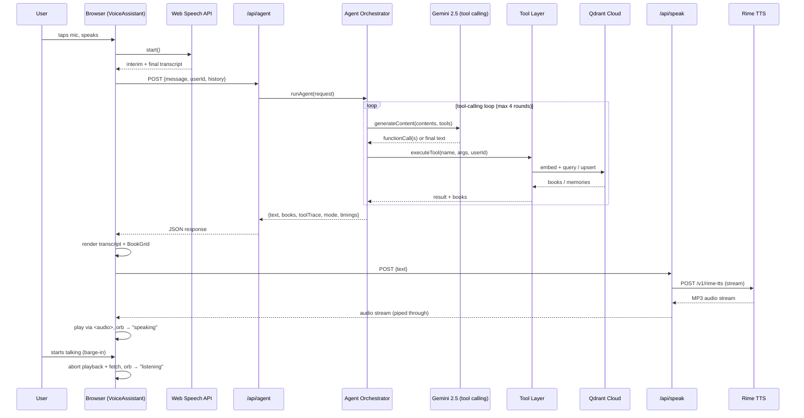

# Architecture

Deep-dive companion to the [README](README.md) — how Athenaeum (star-forge) is put together and
why each piece exists.

## Design goals

1. **Voice is the primary interface, not an add-on.** Every backend response is shaped for being
   spoken (short, no markdown, no bullet points) and every frontend state maps to something the
   user hears or sees change.
2. **Grounded, not hallucinated.** The agent never invents a book — every claim is backed by a
   tool call result from Qdrant or the demo dataset, and the tool trace is returned alongside the
   response for observability.
3. **Never fake a broken integration.** Every external service (Gemini, Qdrant, Rime) is wrapped
   so that a missing key or a failed live call degrades to deterministic demo data — visibly
   tagged `mode: "live" | "demo"` — rather than silently pretending to work or crashing the UI.
4. **Conversational continuity.** The agent receives the last 10 turns of chat history on every
   request, so follow-ups ("which one is shortest?", "is that one available?") resolve correctly
   without the client tracking any server-side session state.

## Request lifecycle

## Layers

### 1. Voice state machine (`components/voice/VoiceAssistant.tsx`)

The single source of truth for the UI's `VoiceState`
(`idle → listening → thinking → retrieving → speaking`, plus `interrupted` and `error`). It owns:

- The `SpeechToTextService` instance (mic capture)
- The `<audio>` element used for Rime playback
- An `AbortController` for in-flight `/api/speak` requests, so barge-in can cancel playback and
  the network request together
- Refs (`stateRef`, `historyRef`, `submitMessageRef`) mirroring state/callbacks for use inside
  event handlers without re-subscribing listeners on every render — required because
  `SpeechRecognition` event handlers are set once per `start()` call

**Barge-in mechanism**: `SpeechToTextService.onSpeechStart` fires the moment the browser detects
voice energy, independent of whether a final transcript has been produced yet. If the assistant is
currently `speaking`, this immediately calls `stopSpeaking()` (pausing `<audio>` and aborting the
fetch) and transitions to `listening` — no waiting for Rime generation or playback to finish.

### 2. STT service (`lib/services/stt.ts`)

A thin wrapper around the browser's native `SpeechRecognition` (Web Speech API), chosen
specifically to avoid a fourth API key/service. It normalizes vendor-prefixed globals
(`webkitSpeechRecognition`), surfaces interim vs. final results, and maps error codes to
user-facing copy (e.g. `not-allowed` → "enable microphone access"). Ambient types for this API
(not in `lib.dom.d.ts`) live in `lib/speech-recognition.d.ts`.

### 3. Agent layer (`lib/agent/`)

- **`tools.ts`** — declares six tools as Gemini `FunctionDeclaration`s
  (`search_books`, `get_book`, `recommend_books`, `check_availability`, `get_user_memory`,
  `save_user_memory`) and an `executeTool` dispatcher that routes to the service layer.
- **`orchestrator.ts`** — the actual agent loop. Builds a Gemini `Content[]` array from
  conversation history, calls `generateWithTools`, and if the model returns function calls,
  executes them via `executeTool` and appends `functionResponse` parts back into `contents` before
  calling the model again (up to `MAX_TOOL_ROUNDS = 4`). Stops as soon as the model returns plain
  text with no function calls.

  **A subtlety that cost real debugging time**: newer Gemini models attach an opaque
  `thought_signature` to function-call response parts and *require* it to be present, unverbatim,
  when that turn is replayed back into `contents` on the next round — reconstructing the
  `functionCall` part by hand (just `{ name, args }`) silently drops it and the next call fails
  with `400 INVALID_ARGUMENT`. The fix: `generateWithTools` returns the raw
  `response.candidates[0].content` (`modelContent`) and the orchestrator pushes that verbatim
  instead of rebuilding it.

- **Demo fallback** (`runDemoAgent`): a small rule-based router (checks for "remember ... like/
  prefer/enjoy" to trigger memory save, otherwise runs keyword search) that activates when
  `GEMINI_API_KEY` is absent, or transparently when a live call throws — the response is tagged
  `mode: "demo"` either way and, on a live failure specifically, includes a one-line note so the
  degradation is visible in the transcript, not silent.

### 4. Service layer (`lib/services/`)

Each external integration is isolated behind a small module with an `isXConfigured()` check, so
callers never need to know whether they're hitting a live API or demo data:

| Service | File | Responsibility |
|---|---|---|
| Speech-to-text | `stt.ts` | Browser `SpeechRecognition` wrapper (client-side only) |
| Text-to-speech | `rime.ts` | Streams Rime's MP3 response straight through as a `ReadableStream` |
| LLM + embeddings | `gemini.ts` | Tool-calling chat (`generateWithTools`) and `embedText` (768-dim, L2-normalized) |
| Vector DB | `qdrant.ts` | Client singleton, collection helpers, the `user_memory` payload-index bootstrap |
| Book retrieval | `books.ts` | `searchBooks` (semantic + payload filters), `getBookById`, `recommendSimilarBooks` — each falls back to `lib/demoData.ts`'s keyword search on any live failure |
| Memory | `memory.ts` | CRUD over the `user_memory` Qdrant collection, with an in-process `Map` fallback in demo mode |

**Why a payload index matters**: Qdrant requires an explicit index on any payload field used in a
`filter` (here, `userId`) before you can query by it — without one, `scroll`/`query`/`delete` with
a `userId` filter throws `400 Bad Request: Index required but not found`. `qdrant.ts` exposes
`ensureMemoryUserIdIndex()`, an idempotent, memoized bootstrap called from every filtered memory
operation, and `scripts/ingest.ts` also creates it explicitly for fresh deployments.

### 5. Data layer

- `data/books.json` — 142 generated books across 14 categories (Fiction, Science Fiction,
  Fantasy, History, Psychology, Computer Science, Artificial Intelligence, Business, Philosophy,
  Self Development, Literature, Economics, Biology, Mathematics), each with title/author/
  description/categories/subjects/year/pages/availability/shelf location, generated by
  `scripts/generateBooks.ts` from hand-written seed data (not templated/randomly generated text)
  so descriptions read naturally.
- `scripts/ingest.ts` — embeds every book via `gemini-embedding-001` (768 dims, L2-normalized) and
  upserts into the `library_books` Qdrant collection (Cosine distance), batched 10 at a time to
  stay within embedding rate limits.

### 6. API routes (`app/api/*/route.ts`)

Thin — each route validates input, calls into `lib/`, and maps errors to friendly, non-technical
messages (never a raw stack trace to the client):

- `POST /api/agent` — the only route the voice UI's text turn goes through
- `POST /api/speak` — proxies Rime's streaming response directly as the Route Handler's `Response`
  body (no buffering — bytes flow to the browser as Rime produces them)
- `GET/POST/DELETE /api/memory` — backs the "My Library" memory panel
- `GET /api/books`, `GET /api/books/[id]` — back Discover and the book detail page

## Why this shape

- **No separate backend service** — Next.js Route Handlers keep the whole app in one deployable
  unit, which matters for a hackathon judging flow (one `vercel deploy`, no service orchestration).
- **Service-layer indirection everywhere** — every external call is one function behind an
  `isXConfigured()` check, which is what makes the demo/live duality possible without `if` checks
  scattered through UI or route code.
- **Tool-calling instead of a hand-rolled intent classifier** — lets the model decide *when* to
  search vs. recommend vs. check availability vs. save memory based on the actual conversation,
  which is what makes multi-turn follow-ups ("which one is shortest?", "is that available?",
  "remember that") work without bespoke state machines per intent.
