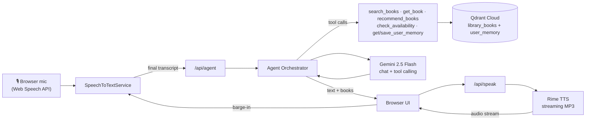

# Athenaeum — Your Library, Spoken

**Live demo:** https://star-forge-bice.vercel.app
**Repository:** https://github.com/zwerty-afk/star-forge

A voice-first AI library assistant built for **VoxForge 2026**. Instead of typing keywords into a
search box, you talk to the library the way you'd talk to a knowledgeable librarian: *"Find me
something beginner-friendly about artificial intelligence"* or *"Recommend something like Atomic
Habits."* Athenaeum listens, understands intent, retrieves grounded answers from a real catalog,
and speaks the response back — including handling interruptions naturally.

> See [ARCHITECTURE.md](ARCHITECTURE.md) for a deep dive: request lifecycle sequence diagram, why
> each layer is shaped the way it is, and specific integration gotchas we hit and fixed (Gemini's
> `thought_signature` requirement, Qdrant payload indexing).

## Why voice matters

Library search boxes require you to already know what you're looking for — an exact title, an
author, a category. Most people don't think that way; they think in vague, conversational terms
("something short and funny about space"). Voice removes that translation step entirely, and lets
the assistant ask clarifying follow-ups the way a person would. This is not a chatbot with a
microphone bolted on — every state in the UI, every tool the agent has, and the way memory is
used are all designed around a continuous spoken conversation.

## Why Qdrant matters

Qdrant is the retrieval backbone of the product, used in three distinct ways:

1. **Semantic book search** (`library_books` collection) — natural-language queries are embedded
   and matched against book descriptions/categories/subjects, so "explains AI without being too
   technical" finds relevant books even without keyword overlap. Combined with payload filters
   (availability, category, author, max pages, min year) for precise, grounded retrieval.
2. **Recommendations** — "similar to X" embeds the source book's text and searches the same
   collection; "recommend something for me" embeds the user's stored preferences instead.
3. **Conversational memory** (`user_memory` collection) — when a user says "remember that I like
   science fiction," that preference is embedded and stored per-user, then retrieved semantically
   on future requests to personalize recommendations.

## Why Rime matters

Every assistant reply is spoken aloud through Rime's streaming TTS endpoint — this is the core
interaction, not a bolt-on. The backend pipes Rime's audio stream directly to the browser via a
Next.js Route Handler, and the client can interrupt playback mid-sentence (barge-in) the moment
the user starts talking again, mirroring how a real conversation works.

## Architecture



**Stack**: Next.js 15 (App Router, TypeScript), Tailwind CSS v4, `@qdrant/js-client-rest`,
`@google/genai` (Gemini 2.5 Flash for chat/tools, `gemini-embedding-001` for embeddings), Rime TTS
over REST, and the browser's native `SpeechRecognition` for STT (no extra API key needed).

### Directory layout

```
app/
  page.tsx                 Home — the voice assistant
  discover/page.tsx        Browse/filter the full catalog
  book/[id]/page.tsx       Book detail + "ask about this book" voice handoff
  memory/page.tsx          View/delete stored preferences
  api/agent/route.ts       Agent loop entry point
  api/speak/route.ts       Streams Rime audio
  api/books/, api/memory/  REST endpoints backing Discover/Memory pages
components/
  voice/                   VoiceOrb, Waveform, VoiceAssistant (state machine)
  transcript/, books/, memory/, layout/, ui/
lib/
  services/                stt.ts, rime.ts, gemini.ts, qdrant.ts, memory.ts, books.ts
  agent/                   tools.ts (tool declarations + execution), orchestrator.ts
  demoData.ts              Deterministic fallback used when live APIs are unavailable
data/books.json            142 generated books across 14 categories
scripts/
  generateBooks.ts         Regenerates data/books.json
  ingest.ts                Embeds books.json and upserts into Qdrant
```

## Voice states

`idle → listening → thinking → retrieving → speaking`, plus `interrupted` (user talks over the
assistant) and `error` (friendly recovery copy, never a raw stack trace). Each state has a
distinct orb animation, waveform behavior, and status line, driven entirely by
`components/voice/VoiceAssistant.tsx`.

## Setup

### 1. Install dependencies

```bash
npm install
```

### 2. Environment variables

Copy `.env.example` to `.env.local` and fill in:

```bash
RIME_API_KEY=       # https://rime.ai
QDRANT_URL=         # https://cloud.qdrant.io — cluster URL
QDRANT_API_KEY=
GEMINI_API_KEY=     # free tier, no card required — https://aistudio.google.com/apikey
```

The app runs with **any subset** of these configured — each service module
(`lib/services/*.ts`) independently falls back to deterministic demo data if its key is missing
or the live call fails, and the API response is tagged `mode: "live" | "demo"` so the UI can show
a small "Demo mode" badge. It never silently pretends a working integration when keys are present
but the call fails — errors are surfaced via toast with a retry action.

### 3. Qdrant setup

Collections are created automatically on first use (`ensureCollection` in `lib/services/qdrant.ts`),
or you can create them explicitly and ingest the dataset in one step:

```bash
npx tsx scripts/ingest.ts
```

This embeds all 142 books in `data/books.json` via Gemini and upserts them into the
`library_books` collection (768-dim, cosine distance). A second collection, `user_memory`, stores
per-user preference embeddings. Regenerate the dataset itself with:

```bash
npx tsx scripts/generateBooks.ts
```

### 4. Run locally

```bash
npm run dev
```

Open [http://localhost:3000](http://localhost:3000). Voice input requires a Chromium-based
browser (Chrome or Edge) — Safari/Firefox don't implement `SpeechRecognition`; the UI detects this
and shows a clear message rather than failing silently.

## Demo mode vs. live mode

| | Demo mode | Live mode |
|---|---|---|
| Trigger | Any of `GEMINI_API_KEY` / `QDRANT_URL` / `RIME_API_KEY` missing, or a live call fails | All three configured and reachable |
| Book search | Deterministic keyword-overlap search over `data/books.json` | Semantic vector search via Qdrant + Gemini embeddings |
| Agent | Rule-based intent routing (`runDemoAgent` in `lib/agent/orchestrator.ts`) | Gemini 2.5 Flash tool-calling loop |
| Memory | In-process `Map`, resets on server restart | Persisted in the `user_memory` Qdrant collection |
| Speech | N/A — `/api/speak` returns a clear 503 if Rime isn't configured | Real streamed Rime audio |

Demo mode exists so the app is always presentable for judging even if a live API has a transient
outage — it is never used to hide a broken integration when credentials are present.

## The judge demo flow

1. **Discovery** — "I'm looking for a beginner-friendly book about artificial intelligence that
   isn't too technical."
2. **Follow-up** — "Which one is the shortest?" (agent uses conversation history)
3. **Availability** — "Is that one available?"
4. **Memory** — "Remember that I prefer books under 300 pages."
5. **Personalized recommendation** — "Now recommend something else for me." (uses stored memory)
6. **Interruption** — while the assistant is speaking, say "Actually, only show me science
   fiction" — playback stops immediately and the new request is handled.

## Testing

```bash
npx tsc --noEmit   # type checking
npm run build      # production build
```

Manual verification performed for this build: all API routes (`/api/agent`, `/api/speak`,
`/api/books`, `/api/memory`) exercised directly against live Rime and Qdrant Cloud; all pages
(`/`, `/discover`, `/book/[id]`, `/memory`) rendered and screenshotted at desktop and mobile
viewports with zero console/page errors.

## Deployment

Deployed on [Vercel](https://vercel.com) at **https://star-forge-bice.vercel.app**, connected to
the `zwerty-afk/star-forge` GitHub repo for automatic deploys on push. `RIME_API_KEY`,
`QDRANT_URL`, `QDRANT_API_KEY`, and `GEMINI_API_KEY` are set as Production environment variables
in the Vercel project dashboard — never committed to the repo. The same 142-book dataset was
ingested once into the production Qdrant collection via `npx tsx scripts/ingest.ts` before going
live.

To deploy your own copy: fork/clone the repo, run `vercel link`, set the four environment
variables with `vercel env add <NAME> production`, then `vercel --prod`.
